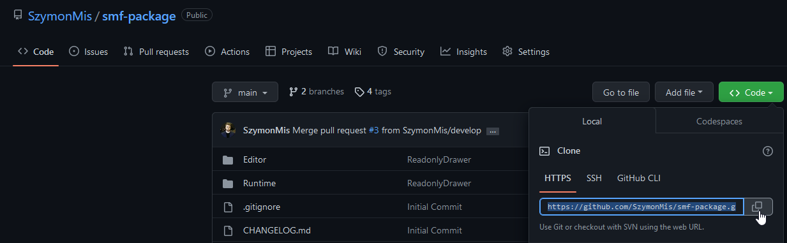
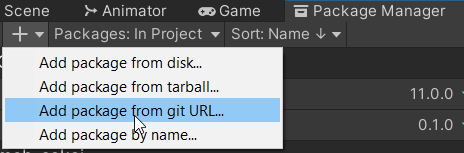
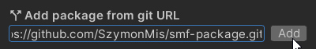

# SMF package
Collection of unity extensions that speed-ups working with an engine

     

## Instalation

### Using Unity Package Manager UI

Copy link from github:



Open Unity Package Manager Window and select "Add package from git URL" option:



Paste link and then click add button



<br><br>

### Using Unity Package Manager Manifest

Find the manifest.json file in the Packages folder of your project and edit it to look like this:

```
{
  "dependencies": {
    "com.szymon-mis.smf": "https://github.com/SzymonMis/smf-package.git",
    ...
  },
}
```

