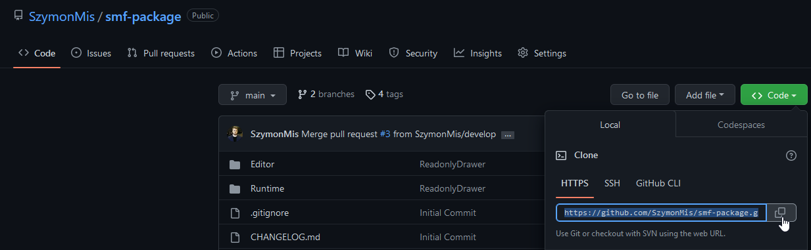
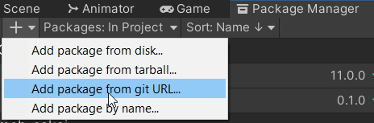
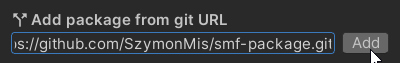

# SMF package
Collection of unity extensions that speed-ups working with an engine

     

## Description


## Content List
 - [Runtime](https://github.com/SzymonMis/smf-package)
	 - [Core](https://github.com/SzymonMis/smf-package)
		 - [Attributes](https://github.com/SzymonMis/smf-package)
          - [ReadOnly](https://github.com/SzymonMis/smf-package)
         - [Misclleanous](https://github.com/SzymonMis/smf-package)
            - [Unparent](https://github.com/SzymonMis/smf-package)
         - [Update Manager](https://github.com/SzymonMis/smf-package)
     - [Extensions](https://github.com/SzymonMis/smf-package)
         - [Custom Colliders](https://github.com/SzymonMis/smf-package)         
            - [Cylinder Collider](https://github.com/SzymonMis/smf-package)
            - [Stairs Collider](https://github.com/SzymonMis/smf-package)
            - [Arc Collider](https://github.com/SzymonMis/smf-package)
            - [Arc Stairs Collider](https://github.com/SzymonMis/smf-package)
         - [Design Patterns](https://github.com/SzymonMis/smf-package)
            - [Singleton](https://github.com/SzymonMis/smf-package)         
         - [Types Extensions](https://github.com/SzymonMis/smf-package)
            - [List Extension](https://github.com/SzymonMis/smf-package)
            - [String Extension](https://github.com/SzymonMis/smf-package)
 - [Editor](https://github.com/SzymonMis/smf-package)
     - [Core](https://github.com/SzymonMis/smf-package)
         - [Drawers](https://github.com/SzymonMis/smf-package)
             - [ReadOnly](https://github.com/SzymonMis/smf-package)
     - [Extensions](https://github.com/SzymonMis/smf-package)
         - [Colliders](https://github.com/SzymonMis/smf-package)
     - [Tools](https://github.com/SzymonMis/smf-package)
         - [Group Game Objects By Parameter](https://github.com/SzymonMis/smf-package)
         - [Remove Missing Scripts](https://github.com/SzymonMis/smf-package)

## Installation 

### Using Unity Package Manager UI

Copy link from github:



Open Unity Package Manager Window and select "Add package from git URL" option:



Paste link and then click add button



<br><br>

### Using Unity Package Manager Manifest

Find the manifest.json file in the Packages folder of your project and edit it to look like this:

```
{
  "dependencies": {
    "com.szymon-mis.smf": "https://github.com/SzymonMis/smf-package.git",
    ...
  },
}
```

